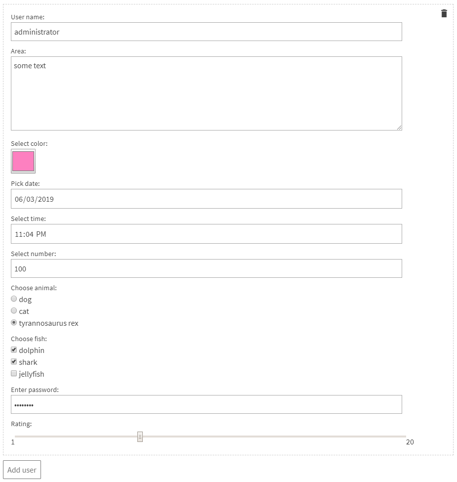
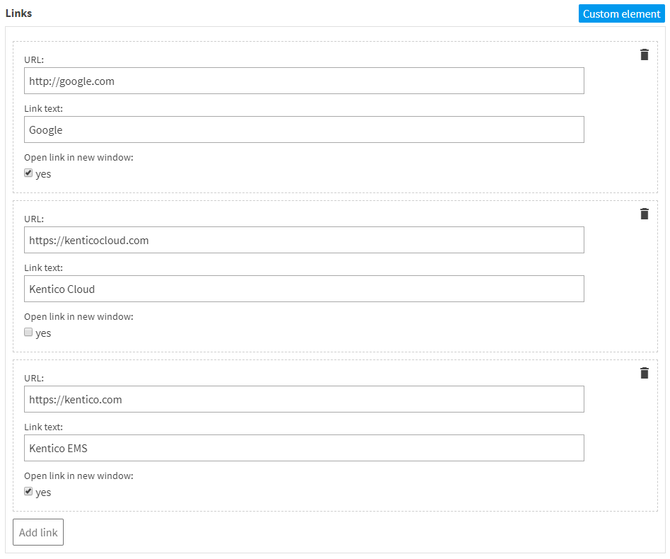
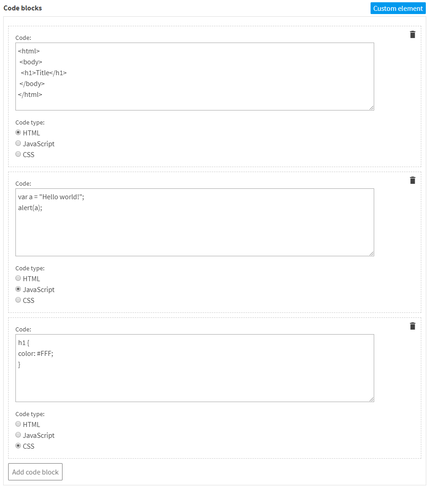

# HTML Inputs Custom Element for Kentico Kontent

This is a [custom element](https://docs.kontent.ai/tutorials/develop-apps/integrate/integrating-your-own-content-editing-features) for [Kentico Kontent](https://kontent.ai) that allows you to define a group of HTML inputs that your editors can fill out one or more times. You can combine any number of HTML5 inputs into a single element -> text, textarea, color, date, time, number, radio, checkbox, password and range.



## Setup

1. Deploy the code to a secure public host
   - See [deploying section](#Deploying) for a really quick option
1. Follow the instructions in the [Kentico Kontent documentation](https://docs.kontent.ai/tutorials/develop-apps/integrate/integrating-your-own-content-editing-features#a-3--displaying-a-custom-element-in-kentico-kontent) to add the element to a content model.
   - The `Hosted code URL` is where you deployed to in step 1
   - If necessary, pass the necessary parameters as directing in the [JSON Parameters configuration](#json-parameters) section of this readme.

## Deploying

Netlify has made this easy. If you click the deploy button below, it will guide you through the process of deploying it to Netlify and leave you with a copy of the repository in your GitHub account as well.

[](https://app.netlify.com/start/deploy?repository=https://github.com/Kentico/kontent-custom-element-sample-html-inputs)

## JSON Parameters

The main `name` property is used for identifying the wraping object. The value of this is also used for buttons used to add or delete a group of inputs.

You have to configure the `name` and `type` properties for each of your inputs. Other input parameters such as label are optional. For radio butons and checkboxes you need to specify a list of options.

Following example shows all inputs used just once with all their configuration options:

```Json
{
  "name": "user",
  "inputs": [
    {
      "name": "username",
      "type": "text",
      "label": "User name:",
      "placeholder": "add some text"
    },
    {
      "name": "area",
      "type": "textarea",
      "label": "Area:",
      "placeholder": "enter some content"
    },
    {
      "name": "color",
      "type": "color",
      "label": "Select color:"
    },
    {
      "name": "date",
      "type": "date",
      "label": "Pick date:"
    },
    {
      "name": "time",
      "type": "time",
      "label": "Select time:"
    },
    {
      "name": "number",
      "type": "number",
      "label": "Select number:",
      "min": 10,
      "max": 100,
      "step": 5,
      "value": 50
    },
    {
      "name": "animals",
      "type": "radio",
      "label": "Choose animal:",
      "options": [
        [
          "dog",
          "dog"
        ],
        [
          "cat",
          "cat"
        ],
        [
          "rex",
          "tyrannosaurus rex"
        ]
      ]
    },
    {
      "name": "fish",
      "type": "checkbox",
      "label": "Choose fish:",
      "options": [
        [
          "dolphin",
          "dolphin"
        ],
        [
          "shark",
          "shark"
        ],
        [
          "jellyfish",
          "jellyfish"
        ]
      ]
    },
    {
      "name": "pass",
      "type": "password",
      "label": "Enter password:",
      "placeholder": "enter some password"
    },
    {
      "name": "range",
      "type": "range",
      "label": "Rating:",
      "min": 1,
      "max": 20,
      "step": 1
    }
  ]
}
```

## What is Saved?

The JSON object returned from the Deliver API. The output varies based on the configured inputs. For example, if you use the example configuration in the [JSON Parameters configuration](#json-parameters) section the output would look like:

```Json
[
  {
    "username":"administrator",
    "area":"some text",
    "color":"#ff80c0",
    "date":"2019-06-03",
    "time":"23:04",
    "number":"100",
    "animals":"rex",
    "fish":[
        "dolphin",
        "shark"
    ],
    "pass":"password",
    "range":"7"
  }
]
```

## Examples

### Group of Links



Saved value:

```Json
[
  {
    "url":"http://google.com",
    "text":"Google",
    "target":[
      "_blank"
    ]
  },
  {
    "url":"https://kontent.ai",
    "text":"Kentico Kontent",
    "target":[]
  },
  {
    "url":"https://kentico.com",
    "text":"Kentico EMS",
    "target":[
      "_blank"
    ]
  }
]
```

### Group of Code Blocks



Saved value:

```Json
[
  {
    "code":"<html>\n <body>\n  <h1>Title</h1>\n </body>\n</html>",
    "type":"html"
  },
  {
    "code":"var a = \"Hello world!\";\nalert(a);",
    "type":"js"
  },
  {
    "code":"h1 {\ncolor: #FFF;\n}",
    "type":"css"
  }
]
```
